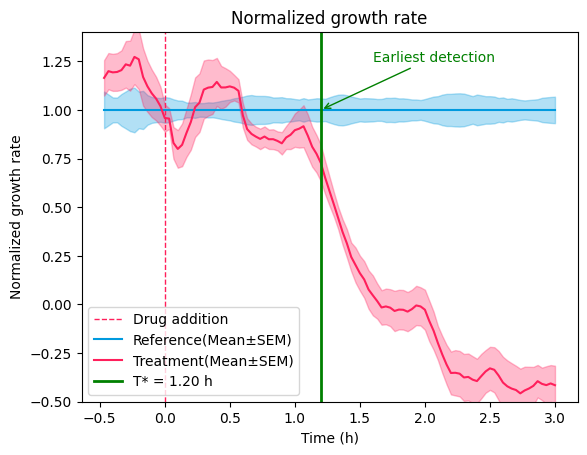
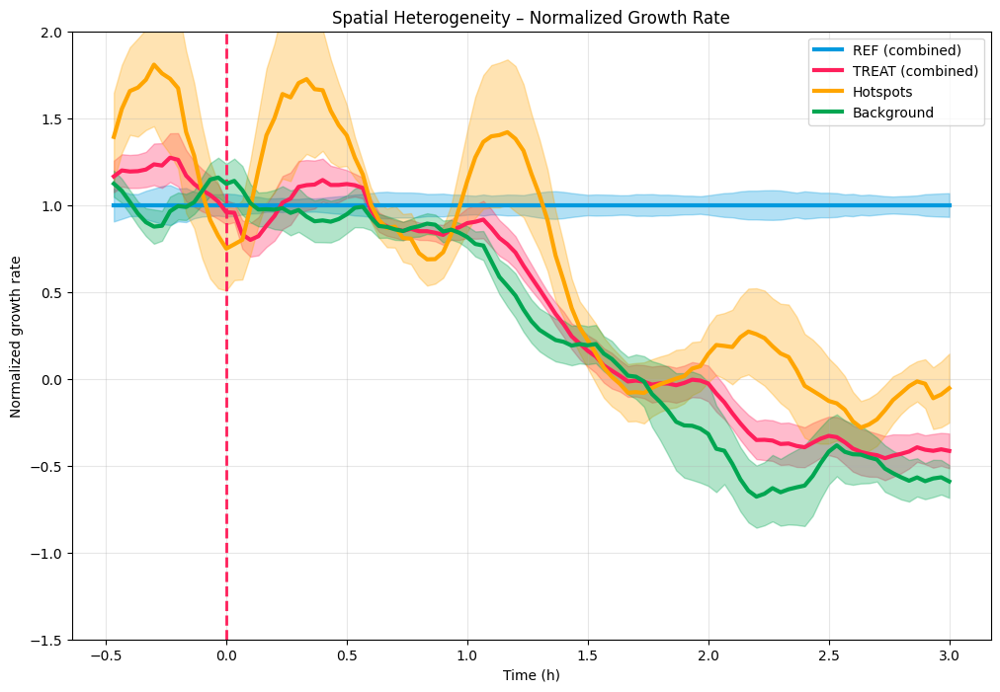

# Experimentation Overview

The following notebooks implement different approaches for early detection of antibiotic effects on bacterial growth.

## General Notes

All experiments are provided as Jupyter notebooks (.ipynb) that can be run directly in Google Colab using the badges provided, or locally with the listed requirements. There are markdown cells with interpretation and explanation as the notebooks can be a bit hard to follow. The results of the notebooks are not saved but printed in the cells, except for the Early Detection notebook where CSV files for all chambers need to be saved in the same folder. Some experiments need a lot of time to run, and GPU is recommended for SAM and SAM2.

## Data

The data used in this analysis are saved in Google Drive in the following folders:

| Dataset | Link |
|---------|------|
| REF_raw_data101_110 | [Google Drive](https://drive.google.com/drive/folders/1VyvKuE8N2X7BpnwyaeGYNAak3_VqkBqX?usp=sharing) |
| REF_masks101_110 | [Google Drive](https://drive.google.com/drive/folders/1aT16Qkiu2Ox5Kxpi_J7cbFHYA7-MdSae?usp=sharing) |
| RIF10_raw_data201_210 | [Google Drive](https://drive.google.com/drive/folders/1DBQTIAWk-kVcViBWLZh1PCyS-eINlRFA?usp=sharing) |
| RIF10_masks201_210 | [Google Drive](https://drive.google.com/drive/folders/16_taCxRsJeBeEP7VeIc1Sz-1MnO1X5xD?usp=sharing) |

## Tran_methodology.ipynb (Baseline)

[](https://colab.research.google.com/drive/1C2j8_W0sJJlRBLsPECPZ2b-EqCgrZvam?usp=sharing)

**Requirements:**
```
numpy
opencv-python
matplotlib
scipy
torch
```

**How to run:**
This notebook is a recreation of the baseline figures. It was run on a GPU T4 runtime but can also be run locally. Replace the paths `ref_dir` and `treat_dir` with the location of your data folders, then run all cells sequentially.

As a baseline, `Tran_methodology.ipynb` includes all the functions from `EXP-23-BZ3167.ipynb` for:
- Processing Omnipose segmentation masks and computing bacterial areas
- Fitting a rolling-window exponential model *A(t) = a·e^(bt)* to extract growth rates
- Generating figures (area curves, growth-rate curves, normalized plots)
- Computing the **detection time**, the earliest point where treatment diverges from reference

These functions will be reused throughout the experimentation for area/growth-rate computation and figure generation.



The figure shows the normalized growth rate of treated versus untreated conditions. The detection time *T* is the earliest time point at which treated and untreated growth rates differ significantly (Welch t-test, p < 0.05).

## Finetuning_Sam_experiments.ipynb

[](https://colab.research.google.com/drive/1ZZ2NPX5iHTRP6cnBVBNm_N9xf8fH032x?usp=sharing)

**Requirements:**
```
torch
torchvision
segment-anything (git+https://github.com/facebookresearch/segment-anything.git)
opencv-python
scikit-image
pandas
numpy
matplotlib
tqdm
scikit-learn
loralib
```

**How to run:**
This notebook was run on a GPU T4 runtime and requires GPU for training. Everything is mounted on Google Drive, so model weights will be saved there. Run the code sequentially to set up the appropriate formats for the dataset, the model, and the training/evaluation functions. The experimentation starts in the "Experiments" section where you can run the examples or change the configurations (e.g., `exp_name`, `batch_size`, `num_epochs`, `learning_rate`, `lora_rank`, etc.). For any changes, make sure to update the paths accordingly.

The initial research question focused on whether **improving cell segmentation** could reduce noise in area-based growth measurements and, as a result, enable earlier detection of antibiotic effects.

For this purpose, the **general SAM model** is fine-tuned using LoRA with different configurations. The dataset is split into train, validation, and test sets. The best configuration was **LoRA rank 32**, achieving Dice = 0.9275, IoU = 0.8649, Precision = 0.9113, Recall = 0.9443, F1 = 0.9275.

However, the fine-tuned model must be evaluated on an unseen test dataset to generate figures and compute the detection time, allowing comparison with the baseline Omnipose model.

## Heterogeneity_analysis.ipynb

[](https://colab.research.google.com/drive/1HLfq0pOjPSCWUN7Q2OXvBF97lKkHtnoc?usp=sharing)

**Requirements:**
```
numpy
opencv-python
matplotlib
scipy
torch
tqdm
Pillow
```

**How to run:**
This notebook was run on a GPU T4 runtime but can also be run locally. There is an example demonstrating how the approach works on one chamber, and then the method is extended to all chambers in the "Actual Analysis" section. Make sure that the paths for `ref_dir` and `treat_dir` are correct, then run all cells sequentially.

Since fine-tuning a model using masks from another model as ground truth is not scientifically correct, an alternative approach was explored, analyzing **heterogeneity**. Some cells may continue growing rapidly while others slow down or stop.

Each chamber (both reference and treated) is divided into 3 horizontal patches, and the area of each region is measured over time. Growth rates are computed for every patch, and the patch with the highest average growth is labeled as the **hotspot**. The hotspot growth curve is then compared with the **background** (average of the remaining patches).



The results in the figure are not very clear as the dataset used does not exhibit strong heterogeneity. However, visual inspection added in the notebook shows that the algorithm finds logical regions that appear to grow faster than the other patches.

## Early_detection_Sam2.ipynb

[](https://colab.research.google.com/drive/1oVrnIiyG9pM2qB_8aTZ564i5DaDEzdGT?usp=sharing)

**Note**: This notebook is too large to be displayed on GitHub. Please use the Colab link above to view it.

**Requirements:**
```
numpy
matplotlib
opencv-python
scipy
torch
torchvision
Pillow
pandas
sam2 (git+https://github.com/facebookresearch/sam2.git)
```

The notebook also downloads the SAM2 checkpoint (`sam2.1_hiera_large.pt`) automatically.

**How to run:**
This notebook was run on a GPU T4 runtime and requires GPU. There are examples demonstrating how the method works on a single chamber, followed by the full analysis on all positions in the "All Positions Analysis" section. Unfortunately, to run the analysis you need to change the `tiff_dir` folder path for each chamber manually. The results for all different positions are saved as CSV files in a Google Drive folder defined by `BASE_DIR` (e.g., `/content/drive/MyDrive/POSITION_RESULTS`). These CSV files are required for computing the evaluation metrics in Method 1 and Method 2. Be careful with how these paths are used and where you want to save the results.

Another approach was to use a model suitable for video tracking with inference only (no training on the dataset). **SAM2** is used for segmentation and mask propagation, where each cell is given an initial mask and SAM2 propagates it across all frames. From these masks, single-cell area curves and growth rates are computed.

Two detection methods are considered:
- **Method A (Chamber-Level Mean Growth)**: Growth rates are averaged across all cells in a chamber, then treated vs. reference curves are compared to find when they diverge. The same approach as Tran et al. for creating figures and computing detection time was applied.
- **Method B (Single-Cell Distribution Analysis)**: The goal is to define a single-cell antibiotic response metric that detects drug effect earlier than the usual "total area per chamber" growth rate. This method uses the full distribution of single-cell growth rates with three detection signals:
  - *M_cell(t)*: Separation metric comparing mean and std of growth rates between treated and control cells (values > 2 indicate clear separation)
  - *f_slow(t)*: Fraction of cells with growth rate below the 10th percentile of control baseline
  - Welch t-test p-value: Statistical test for significant difference between groups (p < 0.05)

  To prevent false detections from noise, a signal is valid only if the condition holds for three consecutive frames.

**Note**: SAM2's tracking results are unreliable (cells change size, disappear, or merge inconsistently). The Methods section is also not well validated. Results from this notebook should be interpreted with caution.

