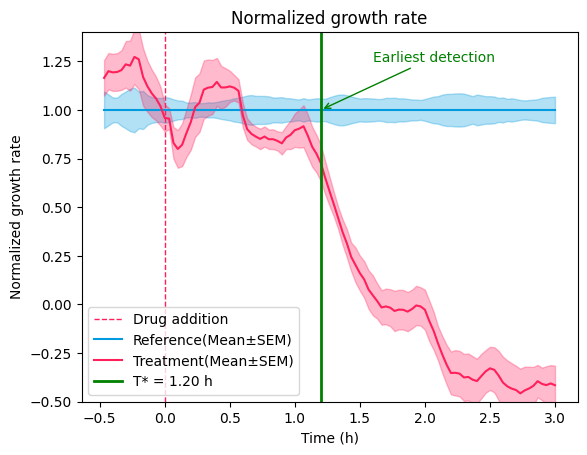
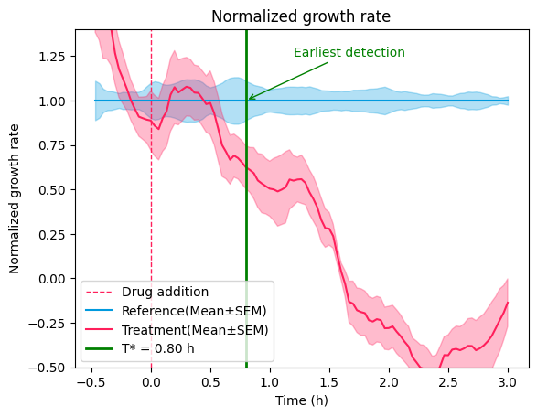
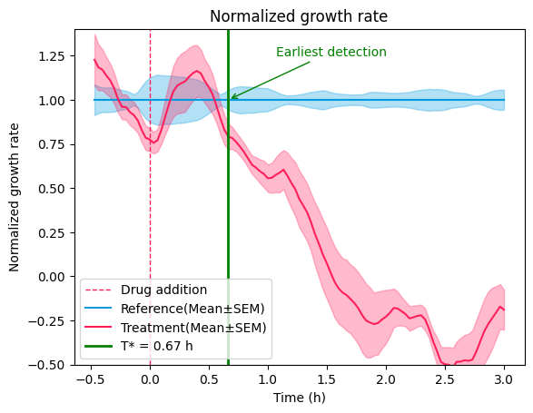

# Experimentation Overview

This repository contains notebooks exploring image analysis methods for tuberculosis susceptibility testing, aiming to reduce detection time and identify spatial heterogeneity in drug response.

## General Notes

All experiments are Jupyter notebooks that can be run in Google Colab (using the badges) or locally. Markdown cells provide interpretation. GPU is recommended for SAM and SAM2 notebooks.

## Data

The data used in this analysis are saved in Google Drive in the following folders:

| Dataset | Link |
|---------|------|
| REF_raw_data101_110 | [Google Drive](https://drive.google.com/drive/folders/1VyvKuE8N2X7BpnwyaeGYNAak3_VqkBqX?usp=sharing) |
| REF_masks101_110 | [Google Drive](https://drive.google.com/drive/folders/1aT16Qkiu2Ox5Kxpi_J7cbFHYA7-MdSae?usp=sharing) |
| RIF10_raw_data201_210 | [Google Drive](https://drive.google.com/drive/folders/1DBQTIAWk-kVcViBWLZh1PCyS-eINlRFA?usp=sharing) |
| RIF10_masks201_210 | [Google Drive](https://drive.google.com/drive/folders/16_taCxRsJeBeEP7VeIc1Sz-1MnO1X5xD?usp=sharing) |
| REF_raw_data111_117 (test) | [Google Drive](https://drive.google.com/drive/folders/1ntbYqdowhUJHSm-8_8ZYwKHrxIF_b0BU?usp=drive_link) |
| REF_masks111_117 (test) | [Google Drive](https://drive.google.com/drive/folders/1Jyvr8UBiC6D-5M2FVllXQfmmwh1-8NOH?usp=sharing) |
| RIF10_raw_data211_217 (test) | [Google Drive](https://drive.google.com/drive/folders/1omelouYiyPCpnAUu8uSViEVbUE-5u005?usp=drive_link) |
| RIF10_masks211_217 (test) | [Google Drive](https://drive.google.com/drive/folders/1BxW-EnS9EnXMMJ4SVu_JZB5hz5ALpKdJ?usp=drive_link) |
| Heterogeneity data (25cb5663) | [Google Drive](https://drive.google.com/drive/folders/1_d8E5hrSFSJllJttjImLM-c1Dj305Ut8?usp=sharing) |

## Tran et al. Methodology (Baseline)

Tran et al. methodology computes bacterial cell areas from Omnipose segmentation masks by counting non-zero pixels. Total area per chamber is tracked over time, and growth rates are extracted by fitting a rolling-window exponential model *A(t) = a·e^(bt)* to the area curves. Growth rate curves are normalized by dividing by the mean growth rate of the reference condition. 

A new addition is the computation of the **detection time**, defined as the earliest time point at which treated bacteria differ significantly from untreated controls (Welch t-test, p < 0.05).

**Requirements:**
```
numpy
opencv-python
matplotlib
scipy
torch
```

### Tran_methodology.ipynb

[](https://colab.research.google.com/drive/1C2j8_W0sJJlRBLsPECPZ2b-EqCgrZvam?usp=sharing)

**Data used:** REF_masks101_110, RIF10_masks201_210

**How to run:** There is no need for GPU, it can be run locally. Replace the paths of the masks `ref_dir` and `treat_dir` with the location of your data folders (REF_masks101_110 and RIF10_masks201_210), then run all cells sequentially.

Recreation of the baseline figures using positions 101-110 (reference) and 201-210 (treated). Includes functions for processing masks, computing areas/growth rates, generating figures, and computing detection time. These functions are reused throughout other experiments.



### testing_Tran_methodology.ipynb

[](https://colab.research.google.com/drive/1cgGIGjeONbmQifFytEKhxNo65GIeVUpQ?usp=sharing)

**Data used:** REF_masks111_117 (test), RIF10_masks211_217 (test)

**How to run:** There is no need for GPU, it can be run locally. Replace the paths of the masks `ref_dir` and `treat_dir` with the location of your test data folders (REF_masks111_117 and RIF10_masks211_217), then run all cells sequentially.

Applies the baseline methodology to the independent test set (positions 111-117 and 211-217). Also computes **segmentation quality metrics**: coefficient of variation (CV) measuring variability across positions, and temporal noise measuring frame-to-frame fluctuations.



## SAM Fine-tuning for Improved Segmentation

The **SAM model** is fine-tuned using LoRA to improve cell segmentation and reduce noise in area-based growth measurements. The best configuration was **LoRA rank 32**, achieving Dice = 0.9275, IoU = 0.8649, Precision = 0.9113, Recall = 0.9443, F1 = 0.9275 on the validation set.

**Requirements:**
```
torch
torchvision
segment-anything (git+https://github.com/facebookresearch/segment-anything.git)
opencv-python
scikit-image
pandas
numpy
matplotlib
tqdm
scikit-learn
loralib
```

### Finetuning_Sam_experiments.ipynb

[](https://colab.research.google.com/drive/1ZZ2NPX5iHTRP6cnBVBNm_N9xf8fH032x?usp=sharing)

**Data used:** REF_raw_data101_110, REF_masks101_110, RIF10_raw_data201_210, RIF10_masks201_210

**How to run:** Requires GPU (tested on T4). Replace the paths for raw images and masks (`ref_raw`, `ref_mask`, `rif_raw`, `rif_mask`) with your data folders. Run sequentially to set up dataset, model, and training functions. Experimentation starts in the "Experiments" section where you can change configurations (e.g., `exp_name`, `batch_size`, `num_epochs`, `learning_rate`, `lora_rank`).

Training notebook for fine-tuning SAM with LoRA. The dataset is split into train, validation, and test sets. Model weights are saved to Google Drive.

### testing_SAM.ipynb

[](https://drive.google.com/file/d/1DZnpLCbiRSO0OlgutsX0DtqvwsmGN764/view?usp=drive_link)

**Data used:** REF_raw_data111_117 (test), REF_masks111_117 (test), RIF10_raw_data211_217 (test), RIF10_masks211_217 (test)

**How to run:** Requires GPU. Load the best checkpoint (`tb_sam.pth`) and replace the test data paths. The notebook evaluates the model and saves predicted masks to `SAM_preds/` folders.

Evaluates the best SAM model (LoRA rank 32) on the test set (positions 111-117 and 211-217). Test set performance: Dice = 0.8919, IoU = 0.8049. The trained model generates segmentation masks for subsequent figure creation. The best model is available on [Google Drive](https://drive.google.com/file/d/1kiCAM84ae75DxRlGof7iYZryYXro0HmH/view?usp=sharing).

### testing_SAM_figures.ipynb

[](https://drive.google.com/file/d/15Oj1EGcGtSAljqhQP38HO-qffP_qd2kC/view?usp=drive_link)

**Data used:** SAM-generated masks from testing_SAM.ipynb

**How to run:** No GPU required. 

Generates growth rate figures and computes detection time using SAM-generated masks. Applies the same analysis pipeline as Tran et al. to enable comparison. Detection time: T* = 0.67 hours. Segmentation quality metrics: CV = 0.1494, temporal noise = 0.0072.



## Heterogeneity Analysis

Under antibiotic exposure, some cells may continue growing rapidly while others slow down or stop. When growth is measured only at the population-averaged level, this variability can be hidden, allowing a small resistant subpopulation to remain undetected.

Each chamber is divided into 3 horizontal patches, and the area of each region is measured over time. Growth rates are computed for every patch, and the patch with the highest average growth is labeled as the **hotspot**. The hotspot growth curve is then compared with the **background** (average of the remaining patches).

**Requirements:**
```
numpy
opencv-python
matplotlib
scipy
torch
tqdm
Pillow
scikit-image
```

### Heterogeneity_methodology.ipynb

[](https://drive.google.com/file/d/1qMW6aFp3mCnZCEZSwcRMibNlUR3PoHUl/view?usp=sharing)

**Data used:** [Heterogeneity data (25cb5663)](https://drive.google.com/drive/folders/1_d8E5hrSFSJllJttjImLM-c1Dj305Ut8?usp=sharing)

**How to run:** No GPU required. Replace the paths `ref_dir` and `treat_dir` with your data folders, then run all cells sequentially.

Includes step-by-step analysis on chamber 101, then extends to all chambers in the "Actual Analysis" section. Provides visualization of patch boundaries, hotspot assignments, and normalized growth-rate plots.

.png)

## SAM2 Single-Cell Tracking

**SAM2** is a foundation model for video segmentation that tracks objects across frames given an initial prompt. It was used for single-cell tracking on positions 101–109 (reference) and 201–209 (treated), with inference only (no training). Omnipose masks from the first frame provided initial prompts, and SAM2 propagated each cell across all frames. Single-cell areas were computed, growth rates estimated using sliding-window exponential fitting, then averaged per chamber. Statistical significance (p < 0.05) was required for three consecutive frames to reduce false detections.

**Requirements:**
```
numpy
matplotlib
opencv-python
scipy
torch
torchvision
Pillow
pandas
sam2 (git+https://github.com/facebookresearch/sam2.git)
```

### Early_detection_Sam2.ipynb

[](https://colab.research.google.com/drive/1oVrnIiyG9pM2qB_8aTZ564i5DaDEzdGT?usp=sharing)

**Note**: This notebook is too large to be displayed on GitHub. Please use the Colab link above to view it.

**Data used:** REF_raw_data101_110, RIF10_raw_data201_210

**How to run:** Requires GPU (tested on T4). Change the `tiff_dir` folder path for each chamber manually. Results are saved as CSV files in `BASE_DIR`.

**Note**: SAM2's tracking results are unreliable (cells change size, disappear, or merge). Results should be interpreted with caution.

